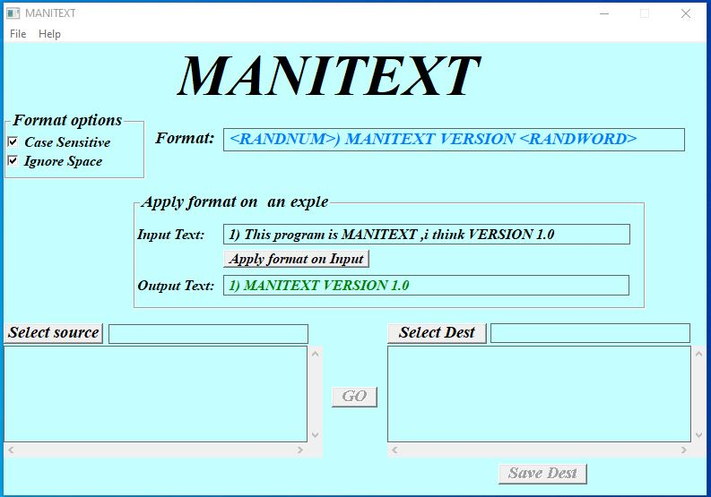
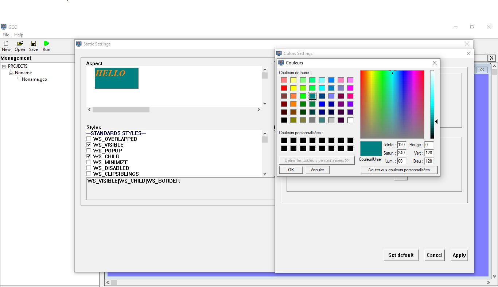
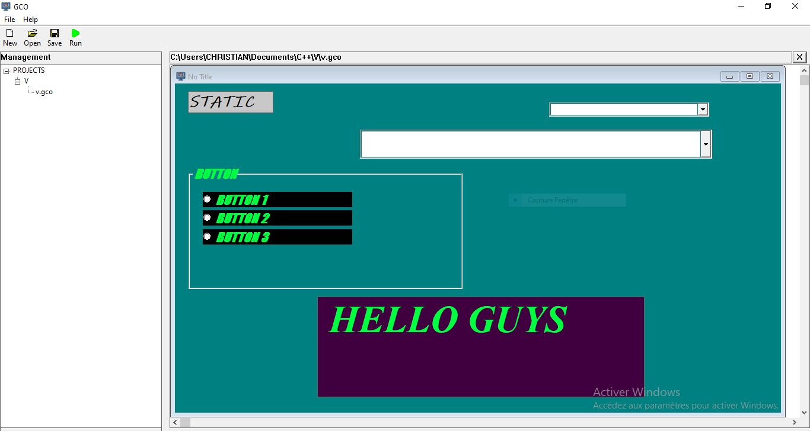
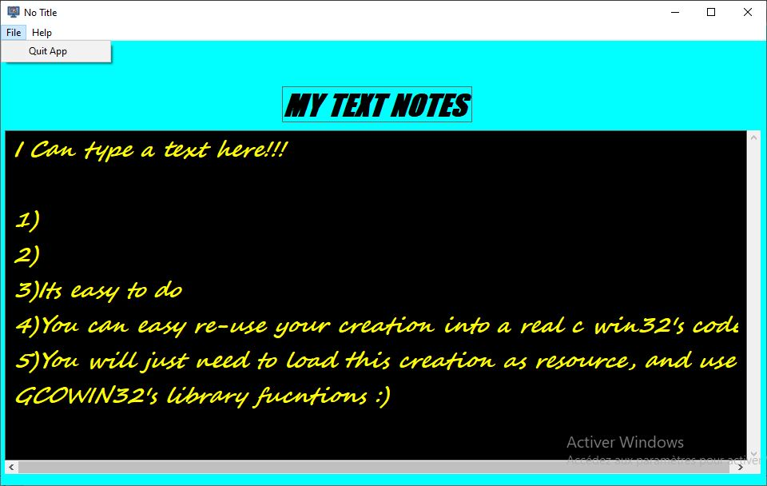
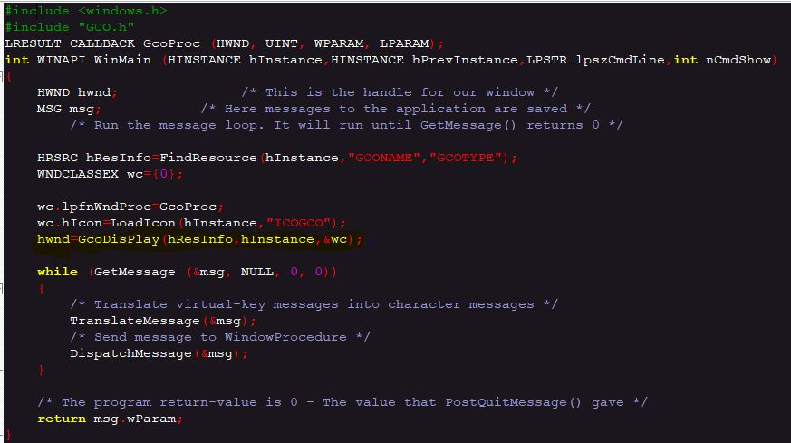
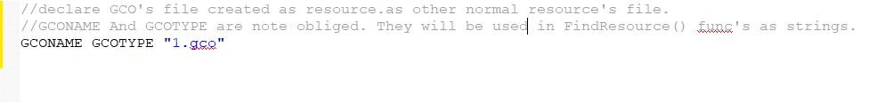

# GCOWIN32 (Graphic Creation Object WIN32)

GCO is a simple GUI's library which simplifies the creation of simple/basic Windows interfaces and controls using the Win32 API for c/c++ win32 developers. With GCO, you can visually design buttons, edit boxes, combo boxes, colors, and fonts without writing a single line of code, and then Load your creation into a c/c++ win32 's code.

## Features

* **Old Win32 Visual Interface Design**: Create your Windows UI by dragging and dropping elements, customizing their appearance and properties in a user-friendly environment.
* **No Code Required**: Design complex interfaces without needing to write any C code. GCO handles the underlying Win32 API calls for you
* **Resource Loading**: GCOWIN32 saves your designs in a `.gco` file, which can be loaded as a resource in your application's code . This allows you to easily recreate your UI at runtime.
* **Customization**: Full control over the look and feel of your interface with options for colors, fonts, and element properties.
* **Create windows with Menu options**: GCOWIN32 Allows you to create windows with menu options .

  
## How to Use GCOWIN32 GUI APP

1. **Design your interface**: Use the GCO editor app to create your window, add elements, and customize their appearance.
2. **Export to .gco file**: Save your design as a `.gco` file.
3. **Load the .gco resource**: Include the `.gco` file as a resource in your IDE and load it through GCO functions  at runtime to create your interface.
4. **For using your creation in a source code, You will need to link your project with libGCO_LIB.a**

## Installation

1. **Compile source code using CmakeList.txt, first Clone [https://github.com/Chrisknight24/GCOWIN32.git]**: Executable app will need GCO's dll(x86 or x64), you will need to place it in a same folder with a .exe's program on windows
2. **Download the appropriate release And run setup**: Go to the [Releases] page and download the pre-release setup executable for your system (x86 or x64).

## Releases

GCO is distributed as source-code, and setup executable for both x86 and x64 architecture

## Contributing/Suggestion/advice
Contributions are welcome! Please feel free to submit pull requests or open issues to report bugs or suggest new features.
We can clearly agree with the fact that the source code isn't really well structured. We are working on.Any advice is welcome.

## SOME IMAGES OF GCO's INTERFACE and GCO Products

 **This Simple windows app, manitext(text extractor) has been done using GCOWIN32 for GUI and win32 API for the rest.**
 
 

 **This is setting control's zone for a static-class control in GCO GUI APP.User manually designs styles, fonts and colors, before create and dragging this object.**
  

 
  **This is an exemple of window, been structured into GCO GUI APP, using drag-drop functionnalities for moving objects(edit,combo,buttons etc)**
   

  
   **With GCOWIN32,you can also create simple windows with menu options**
   

 
 **An example of main() source code, for Displaying a creation done in GCO App, and stored in "1.gco" 's file. You will also need to link your project with gco static library**
   

 
   **A window procedure which is managing your window created isn't too deferent than default win32's model. The big difference is that, you won't manually creating every control yourself.All is done through GCO's DisplayDIsplay() function in main based on .gco's file.**
   
   
   
   **For adding a .gco's file in your project as resource. We are in a .rc file's.**
   

## License

This project is licensed under the MIT License - see the LICENSE file for details.
## Contact
edouardochristian4@gmail.com
